# Django - Marketplace

Learn Django (v4.2.8) by creating a marketplace.

<br>

## Demo

These are pages featured in the project:

### Main Page

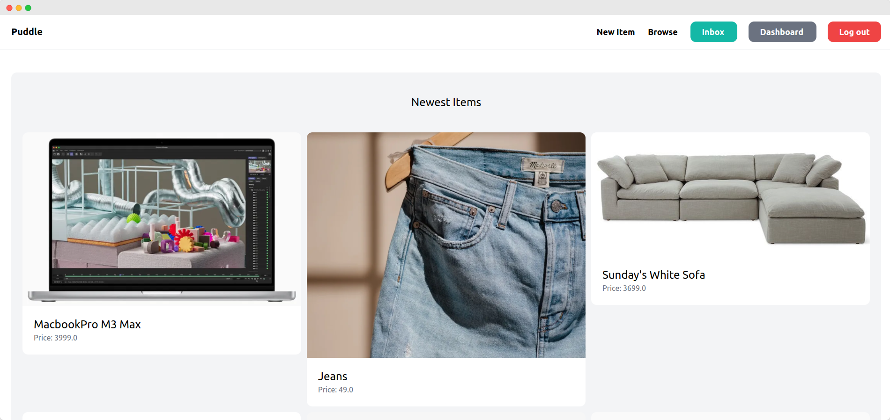

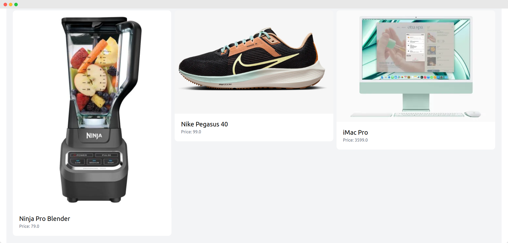

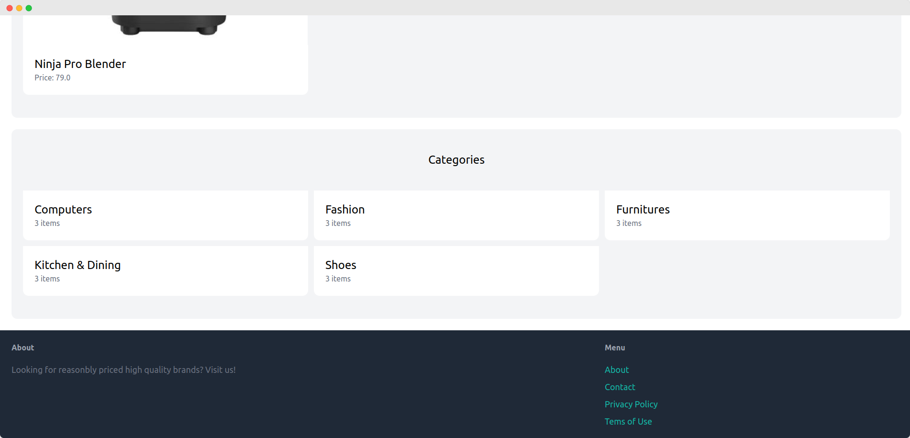

<hr>

### Sign Up

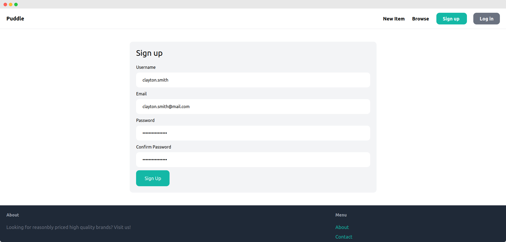

<hr>

### Login

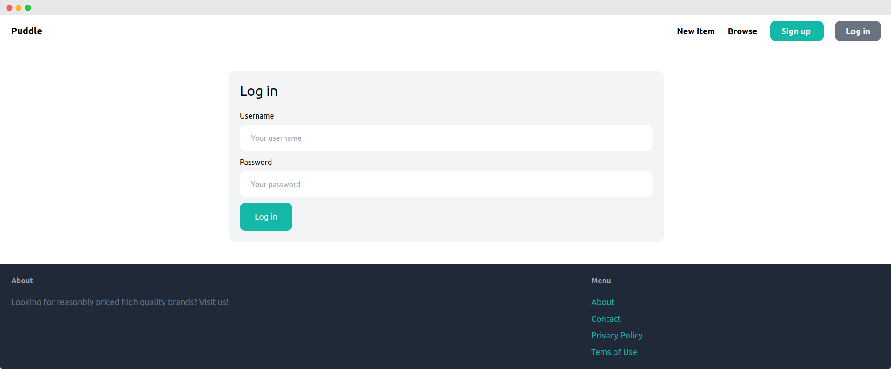

<hr>

### Browse

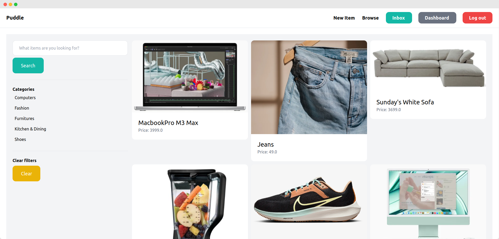

<hr>

### Category

As of now, available categories are as follow:

#### Category - Computers

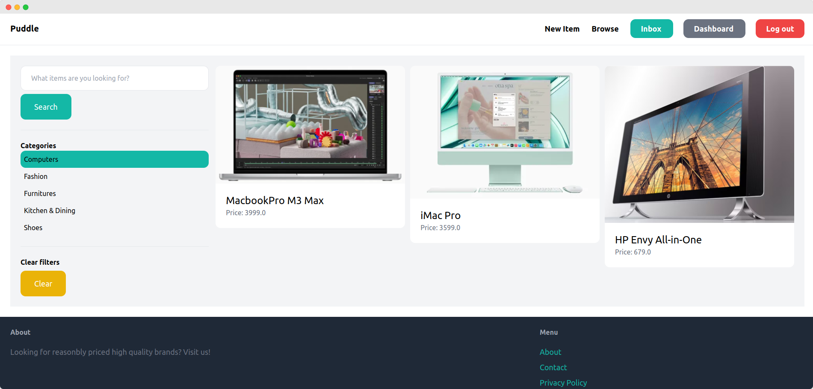

#### Category - Fashion

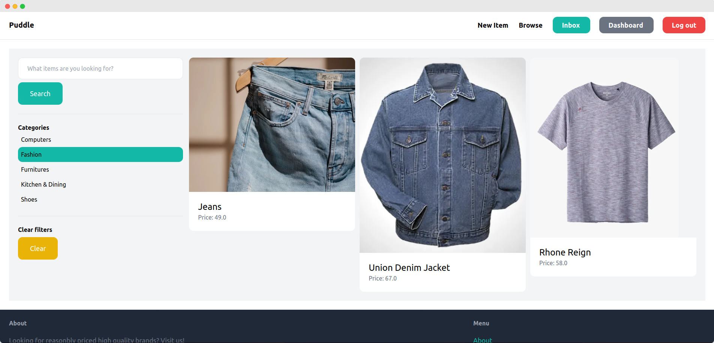

#### Category - Furnitures

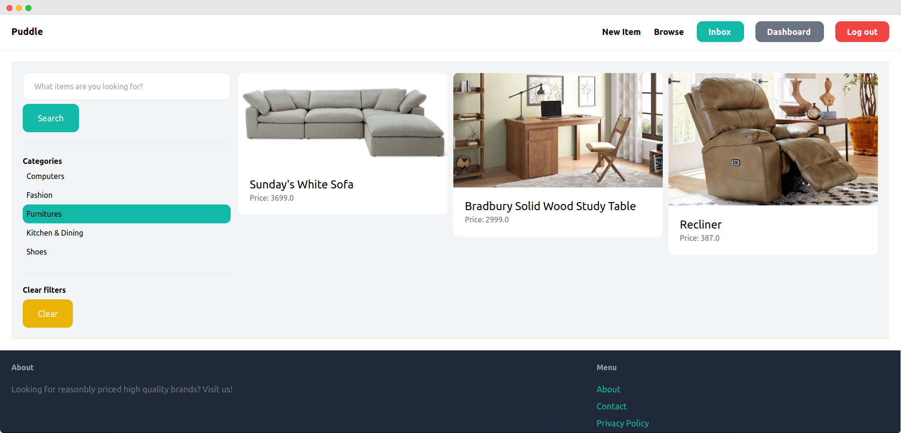

#### Category - Kitchen & Dining

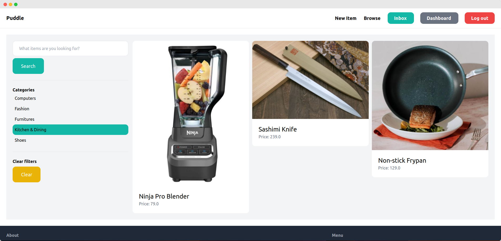

#### Category - Shoes

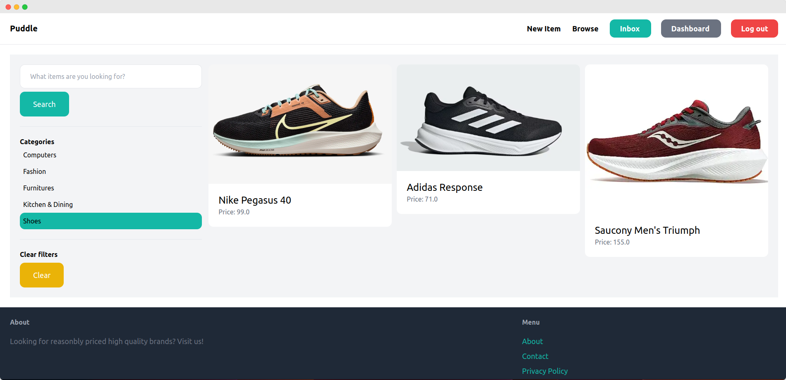

<hr>

### Add Item

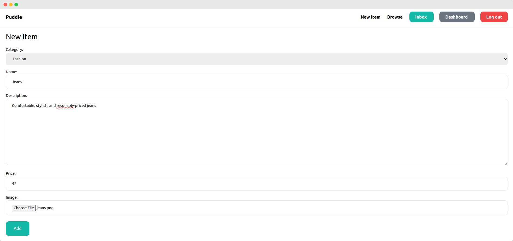

<hr>

### Product Detail

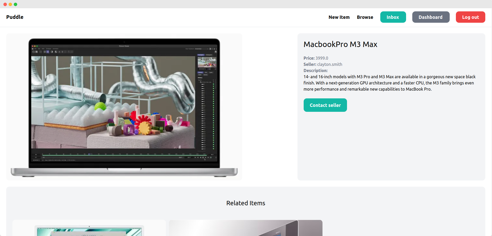

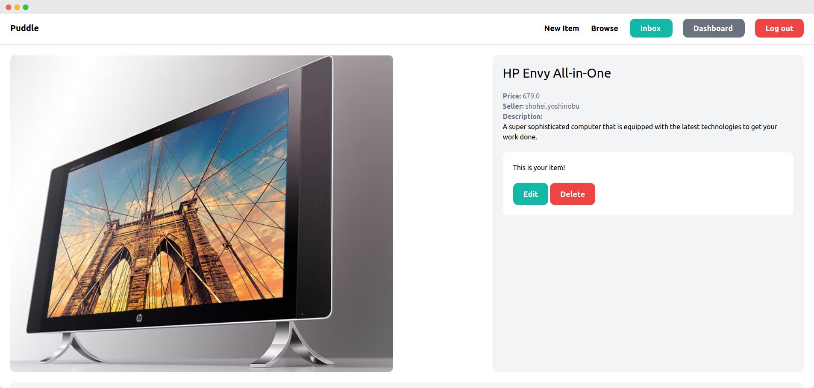

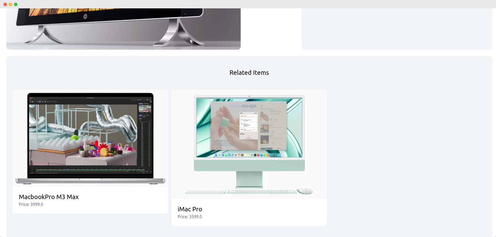

<hr>

### Edit Item

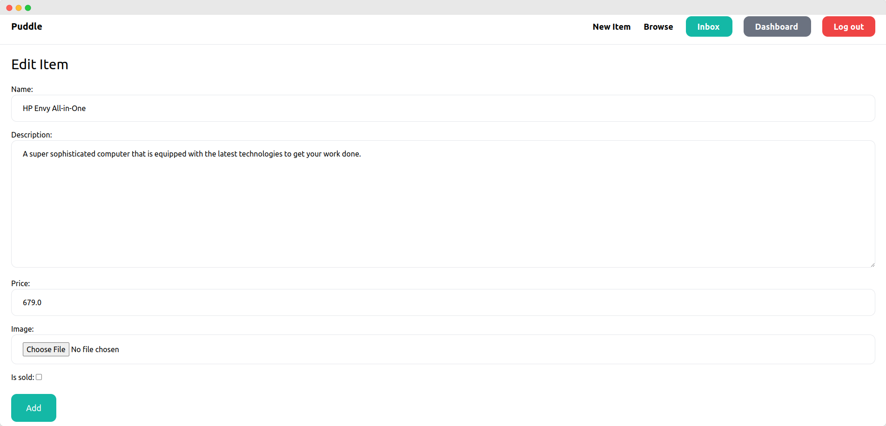

<hr>

### Dashboard

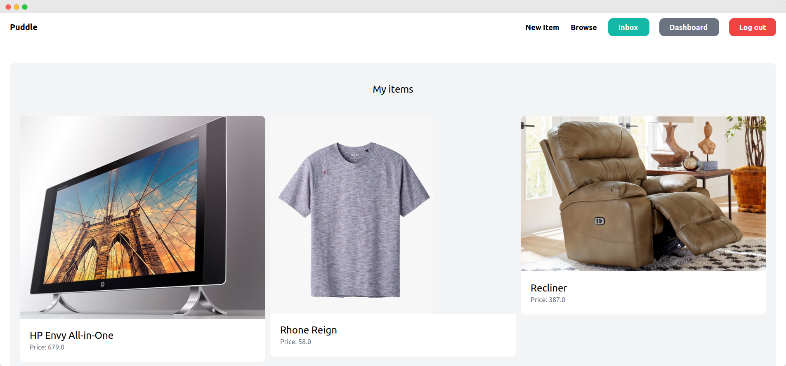

<br>

## Prerequisites

Before running the app, please make sure you have following software installed in your machine:
- [Python 3](https://www.python.org/downloads/)
- [pip](https://pip.pypa.io/en/stable/installation/)
- [MySQL](https://dev.mysql.com/doc/mysql-installation-excerpt/8.0/en/)
- [Git](https://github.com/git-guides/install-git)

<br>

## How to Run

1. Create a virtual environment

```
python3 -m venv .venv
```

2. Navigate to this directory, then activate the virtual environment

```
source .venv/bin/activate
```

3. Install required packages

```python
pip3 install -r requirements.txt
```

4. Make a new file named `.env`, then copy `.env.example` and paste the content into it

```
cp .env.example .env
```

After that, fill `.env` with appropriate values

5. Create a database (Make sure you have MySQL installed in your machine beforehand)

```python
python3 mydb.py
```

6. Apply database migration

```python
python3 manage.py migrate
```

7. Create a superuser of Django admin panel

```python
python3 manage.py createsuperuser
```

You will then by asked several questions, such as `username`, `email`, and `password` of the superuser.

8. Finally, run the server!

```python
python3 manage.py runserver
```

9. Voila! Visit `http://localhost:8000` on your browser

<br>

## To-do list

- Redirect user to a certain category page, if user clicks a particular category
- Change the button text from `Add` to `Edit`, in the edit product page
- Set the footer to touch the lowest screen
- Put available routes in the docs
- Make a Dockerfile
- Generate `requirements.txt` ✅
- Fix plural or singular nouns
- [Make images have same height and width](https://stackoverflow.com/q/19414856)
- [Use environment variables, instead of hardcoded values](https://codinggear.blog/django-environment-variables/) ✅
- [Find out what 'related_name' really is](https://stackoverflow.com/q/2642613)

<br>

## References:

- [Learn Django by Building an Online Marketplace – Python Tutorial for Beginners, by freeCodeCamp](https://youtu.be/ZxMB6Njs3ck)

<br>


